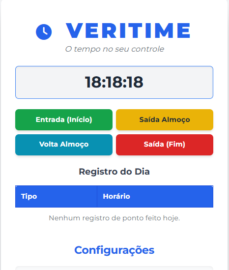

⏰ Veritime: O Tempo no Seu Controle

<p align="center">
  
  
  
</p>

## 🌟 Sobre o Projeto

O Veritime é uma aplicação web simples e minimalista para **Controle de Ponto (Jornada de Trabalho)**. Foi desenvolvido para calcular o tempo trabalhado, gerenciar os intervalos (almoço) e fornecer a hora de saída sugerida, tudo isso diretamente no navegador, sem depender de servidor (client-side).

O foco está na clareza e na usabilidade, utilizando persistência de dados no `localStorage` do navegador para manter os registros do dia.

## ✨ Funcionalidades

* **Marcação de Pontos:** Registrar horários de Entrada, Saída Almoço, Volta Almoço e Saída Final.
* **Relógio em Tempo Real:** Exibição precisa do horário atual.
* **Cálculo da Jornada:** Cálculo automático do tempo trabalhado (líquido).
* **Saída Sugerida:** Previsão do horário de saída baseado na Entrada e na Jornada Meta configurada.
* **Barra de Progresso:** Feedback visual da porcentagem da jornada concluída.
* **Configurações Personalizadas:** Definição da Jornada Meta (ex: 8h) e do Tempo de Pausa (ex: 60min).
* **Persistência de Dados:** Todos os registros e configurações são salvos no `localStorage`.
* **Design Clean:** Estilo moderno e responsivo, graças ao **Tailwind CSS**.

## 🛠️ Tecnologias Utilizadas

O Veritime é um projeto puramente **Front-End**, desenvolvido com a tríade da web:

* **HTML5:** Estrutura semântica.
* **CSS3 (Tailwind CSS):** Framework de utilidades para um design *clean* e responsivo.
* **JavaScript (ES6+):** Lógica principal, cálculos de tempo e persistência de dados (`localStorage`).

## 🚀 Como Executar o Projeto

Como o projeto é totalmente *client-side* (não requer servidor ou banco de dados), a execução é extremamente simples.

### Pré-requisitos

Não há pré-requisitos, além de um navegador moderno (Chrome, Firefox, Edge, Safari).

### Passo a Passo

1.  **Clone o Repositório** (ou baixe os arquivos zipados):
    ```bash
    git clone https://github.com/Renato8318/ProjetoControlePonto/tree/main
    ```
2.  **Navegue até a Pasta do Projeto:**
    ```bash
    cd veritime
    ```
3.  **Abra o Arquivo:**
    Abra o arquivo `index.html` diretamente no seu navegador.

A aplicação estará pronta para uso!

## 📸 Demonstração Visual

**Abaixo, a interface limpa e responsiva do Veritime:**




## 👤 Autor

O projeto Veritime foi desenvolvido por:

| <br /><sub>**Renato Paiva**</sub> |
| :---:

* **Função:** Desenvolvedor Front-End
* **GitHub:** https://github.com/Renato8318
* **LinkedIn:** https://www.linkedin.com/in/renato-paiva2022/ ## 📄 Licença

Este projeto está licenciado sob a Licença MIT.
