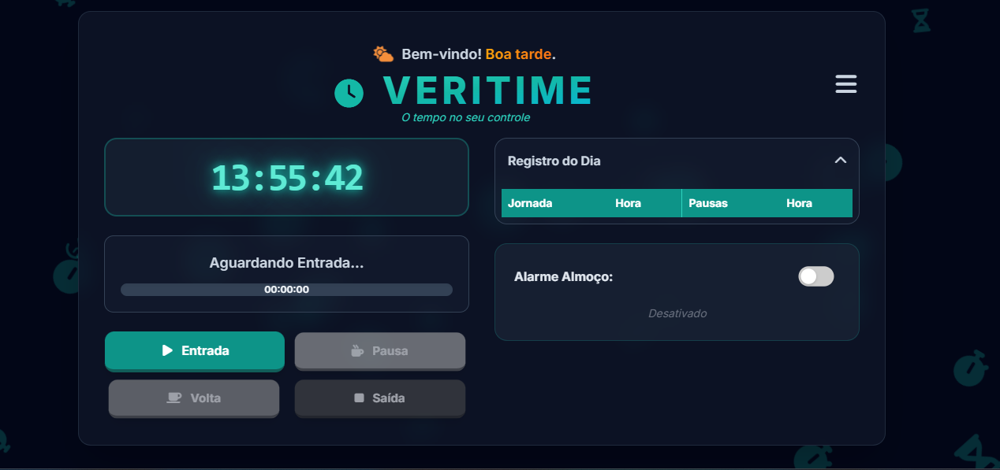

⏰ Veritime: O Tempo no Seu Controle

<p align="center">
  
  
  
  
</p>

## 🌟 Sobre o Projeto

O **Veritime** é uma aplicação web progressiva (**PWA**) de alta performance para **Controle de Ponto Inteligente**. Ele combina um design moderno baseado em **Glassmorphism** com funcionalidades avançadas de sincronização em nuvem e suporte offline total.

Desenvolvido com foco na experiência do usuário (UX), o Veritime guia o colaborador durante sua jornada de trabalho, automatizando cálculos complexos e fornecendo métricas visuais claras.

## ✨ Funcionalidades

*   **PWA (Progressive Web App):** Instalável no celular ou desktop, funcionando como um app nativo.
*   **Modo Offline com Sync Queue:** Registre pontos mesmo sem internet; o sistema sincroniza automaticamente assim que a conexão retornar.
*   **Visual Premium Glassmorphism:** Interface elegante com transparências, efeitos de brilho em movimento e ícones flutuantes no fundo.
*   **Relógio Neon Dinâmico:** Relógio central com efeito de pulso neon no modo escuro.
*   **Cores Semânticas:** Botões inteligentes que mudam de cor conforme a ação necessária (Teal para Entrada, Âmbar para Pausa, Esmeralda para Volta e Rose para Saída).
*   **Relatórios Avançados:** 
    *   **Dashboard de Resumo:** Gráfico de rosca dinâmico com **Chart.js**.
    *   **Relatório Mensal:** Calendário visual com banco de horas diário.
    *   **Exportação:** Gere arquivos **PDF** de alta qualidade ou exporte os dados em **CSV**.
*   **Layout Adaptável:** Otimizado para dispositivos móveis e layouts de duas colunas para notebooks/monitores.
*   **Acessibilidade e Feedback:** Vibração tátil em dispositivos móveis e animações de escala e fade-in.

## 🛠️ Tecnologias Utilizadas

*   **HTML5 & CSS3:** Estrutura e animações customizadas.
*   **Tailwind CSS:** Estilização utilitária e responsividade avançada.
*   **JavaScript (ES6+):** Manipulação de DOM, Fetch API e Service Workers.
*   **Chart.js:** Visualização de dados de jornada.
*   **jsPDF & html2canvas:** Motor de exportação de relatórios para PDF.
*   **MockAPI:** Backend REST para persistência e sincronização de dados.
*   **Service Workers:** Cache de recursos para funcionamento offline.

## 🚀 Como Executar o Projeto

A aplicação consome uma API externa para sincronização, mas mantém um fallback local robusto.

### Pré-requisitos

Um navegador moderno e conexão inicial para o primeiro cache do Service Worker.

### Passo a Passo

1.  **Clone o Repositório:**
    ```bash
    git clone https://github.com/Renato8318/ProjetoControlePonto/tree/main
    ```
2.  **Acesse a pasta:**
    ```bash
    cd veritime
    ```
3.  **Execução:**
    Abra o arquivo `index.html` ou use uma extensão de "Live Server" no VS Code para melhor performance do PWA.

A aplicação estará pronta para uso!

## 📸 Demonstração Visual

**Interface Glassmorphism Teal com Fundo Animado:**




## 👤 Autor

O projeto Veritime foi desenvolvido por:

| <br /><sub>**Renato Paiva**</sub> |
| :---:

* **Função:** Desenvolvedor Front-End
* **GitHub:** https://github.com/Renato8318
* **LinkedIn:** https://www.linkedin.com/in/renato-paiva-developer/📄 Licença

Este projeto está licenciado sob a Licença MIT.
